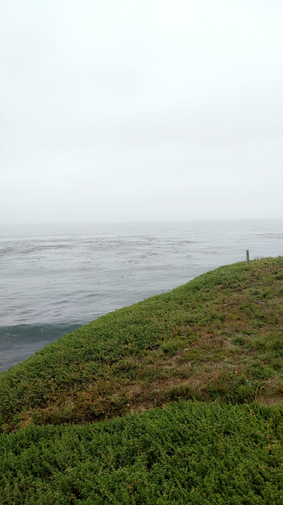
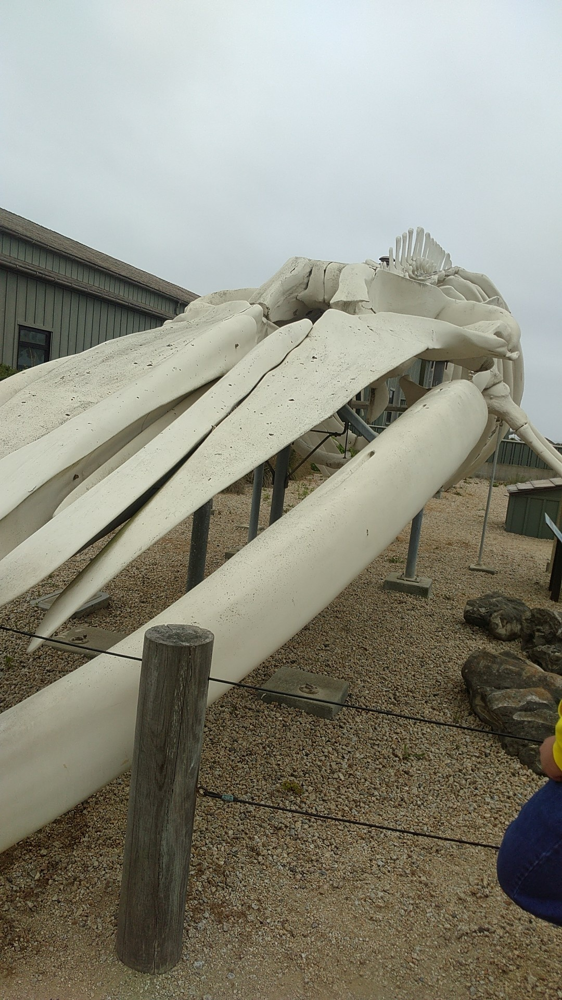
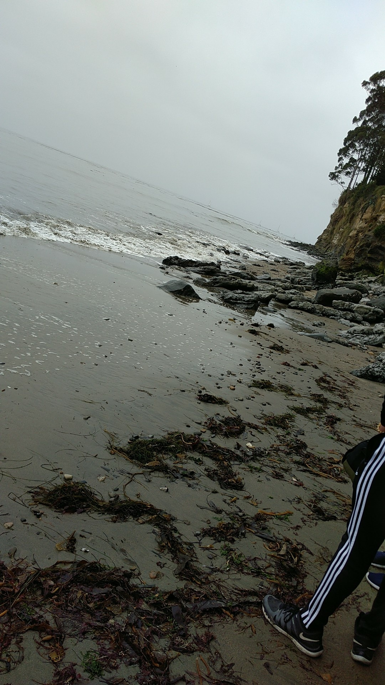

# Blog 1: July 5, 2018
This year's work in the Biodiversity program has been a huge change from what I was accustomed to last year. I can be much more enthusiastic about my work because it requires more analysis and creativity that peaks my interest and effort.

Working with R has been much more interesting too. Noel has empowered us with many tools and resources to do a lot more in R than I could last year.

We also have a book to read this summer, John Tyler Bonner's *Why Size Matters*. I have never read a book like it, except for maybe Randall Munroe's *What If?* Nevertheless, I look forward to complete Bonner's book and I hope it can give me some inspiration or ideas to write about in the research paper.

Speaking of the research paper, Bella, my colleague in the paper, and I have started work on our subject - respiratory systems. We have brainstormed ideas for what data we should analyze and how we should interpret it. Progress can be seen in [our research repository](https://github.com/naheim/paleosizePaper/tree/master/respAnatomy) or maybe even [my own](https://github.com/saketbakshi/bioHSI_2018/tree/master/Work).

On Tuesday, the 3rd of July, we had a trip to New Brighton State Beach and the Seymour Marine Discovery Center in Santa Cruz. At the beach, we observed cliffs of fossils from the Pliocene and Miocene while also checking out some of the living fauna on the rocks, like sea anenome and isopods. The weather was a little cold to see the whole beach but we still had a thorough experience finding bones in rocks and shells in the cliffs.

Next week, starting on the 9th of July, we're going to camp at Pinnacles National Park. We'll stop by some sites to find fossils before we reach the campsite, and we'll go on a "geology hike" at the actual park. I cannot wait for this trip; last year's memories of hiking up the trails and seeing the spectacular view at the summit still resonate in my head.