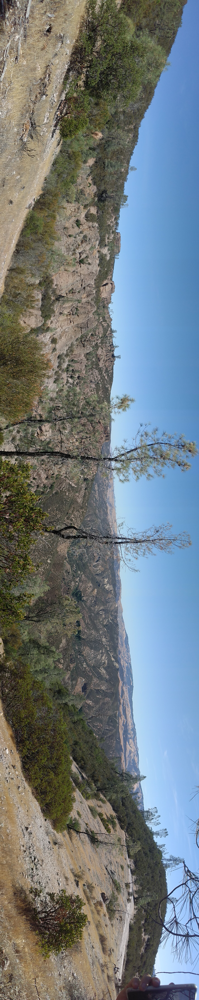

# Blog 2: July 20, 2018
Work on the research paper is going really well. Bella and I have finished all the code for the graphs, and the code is complete in terms of gathering and analyzing data, but I think we still need to smooth out the rough edges of the graphs like consistencies in colors or adding supportive details in the graphs. The proportion graph still needs a legend, for example. We can see a definite advantage for body size to organisms that breathe air. Also, organisms with dedicated organ respiration systems have an advantage over organisms with multi-organ respiration systems, and closed systems have advantage over open systems.

R is an intergral part to our research this year as it was last year. However, my understanding of the language is much greater today than it was a year ago. I am much more comfortable with using loops and if-then statements to filter and organize data into easy-to-analyze graphs. Making subsets of data and using Noel's time.plot function make data analysis much easier than having to manually filter through the data and create graph axes.

In addition to R, we have to code in the terminal to upload to Github. I had trouble with this at first, but Noel and Chris were able to help me out. I had no trouble selecting working directories and pushing my work up to [paleosizePaper](https://github.com/naheim/paleosizePaper/tree/master/respAnatomy) and my own [bioHSI_2018](https://github.com/saketbakshi/bioHSI_2018/tree/master/Work) repository, but pulling data back from paleosizePaper was troublesome. I had difficulty with the "git pull origin" command but then there was a fix in using ":wq" to smooth out the cloud sync.

The last coding "platform" is Markdown. This is also fairly easy to use but including images and embedded links within .md files and blog posts is a little unfamiliar. I'm getting accustomed to using all three languages, however, so I don't anticipate further computational problems.

We have continued reading *Why Size Matters* in our group discussions. It is interesting how Bonner adds his own personal details within his book; some interns complain that it is a distraction, and while I agree, I also maintain that it does clarify some of the concepts he introduces in his book. Ameya and I held our own discussion on chapter 4 on Thursday, the 19th of July. It went well; we discussed how size could expand with structure and the abstract idea of polyploidy organisms with larger cells of fewer counts.

The Pinnacles Trip from what feels like ages ago but was only last week was amazing. Although it was really hot, I still had a fantastic time. Our day started at Patriot Park down south from the Bay Area, near the Salinas Valley, where I had loads of fun remniscing on seesaws and playground structures while eating elementary-school-esque lunch meat sandwiches and eating fruits. We then proceeded to go into the Salinas Valley range to collect bivalve, crab, and gastropod (I think they were gastropods) fossils.  Collecting in the heat was really intense but it was fun nevertheless. I recommend to future interns - if you are reading these - that you bring wide hats and t-shirts or thin long-sleeves if you sunburn easily. Or bring sunscreen. After fossil collecting, we went to our Pinnacles campsite to set up tents. I went to the pool with some of the undergrad and graduate students, but every other intern went to Pinnacles to check out some caves. The caves were closed, so they checked out something else, but I can confirm the pool was definitely open and definitely a cold place to relax and escape from the heat of the day. Future interns: BRING BUG SPRAY. Last year, this wasn't a problem, but this year, the absurd numbers of flies and wasps were horribly irritating. We cook chicken at the campsite, which attracts these yellow jacket wasps, so beware of any stings or intimidating little insects. The food was still excellent though, because it was all fresh and cooked at the site. At night, us interns had a blast checking out the clear sky and playing games.  The next day, we woke up with the flies and ate oatmeal for breakfast. We quickly made sandwiches for our lunch on the Pinnacles hike and then packed our stuff at the campsite. Small aside: my sandwich was fantastic. I made a Big Mac-style sandwich with bread-mayo-ham-cheddar-mustard-bread-peanut butter-ham-cheddar-bread. It was unforgettable. We drove to the base of the Pinnacles hike trail and proceeded to walk up the trail. The views of the scenery were beautiful and Noel's commentary of rock deposits was also thought-provoking.  I never realized how much the type of volcanic explosion would affect the composition of deposited rocks. The hike was shorter this year, likely due to the smaller group, but it was so much hotter. I took a picture of the whole group at the same spot as the picture I took last year, so that felt nice.  Reaching the top of the trail was so satisfying. Noah and I sped ahead to reach the top where we sat at the same place as we did last year to eat our lunch. Somehow I had my LTE connection so we were able to watch the France-Belgium semi-final matchup of the World Cup too. We chilled at the top for about half an hour and then fast-walked down the trail. We finished it fairly quickly, so I was able to be home by 3:00 or so.

These next few weeks should be quite different to the past few. I think Bella and I will be able to work in tandem much more to finish our writing for the research paper, now that all our graphs are prepared. I'm slightly intimidated by the thought of writing so much simply because I have never written a research paper before, but I look forward to confronting the challenge.

I wish I could say that I am going to the Redwood City Bay field trip. However, the commuting times and methods of transportation are too inconvenient to be able to travel to the field trip and come back home. I'm hoping the next set of blogs can entertain me.